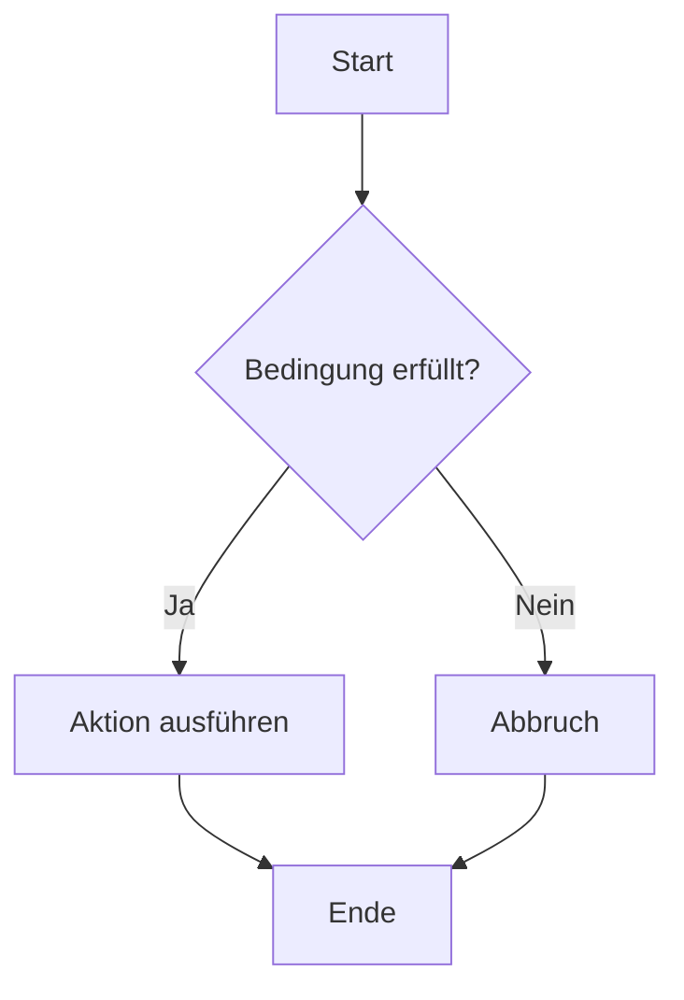

# Hallo GitHub Workshop

[🐞 Bug melden](https://github.com/GregorBiswanger/t-801-hello-github/issues/new?template=bug_report.md)
[🐞 Bug melden](https://github.com/GregorBiswanger/t-801-hello-github/issues/new?template=bug_report.md&labels=bug&title=Fehler%20gefunden)

lorem ipsum

